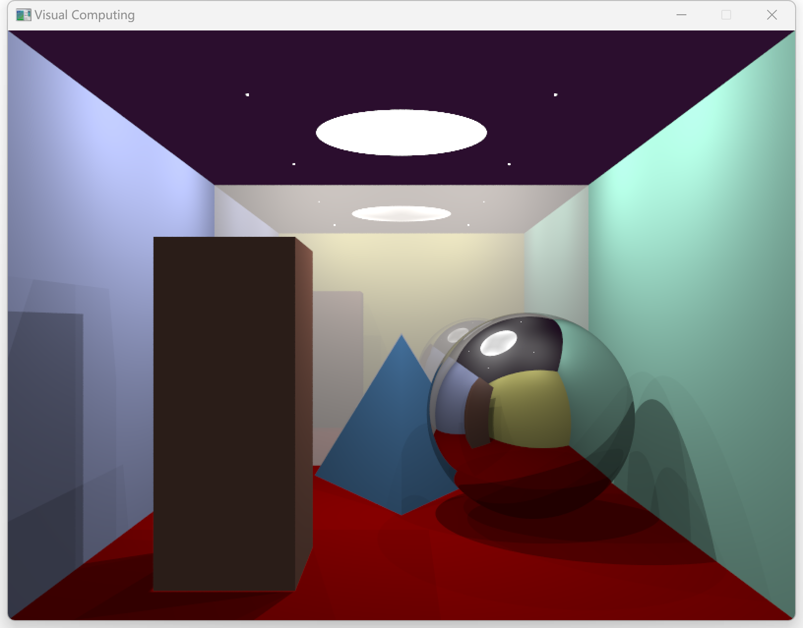
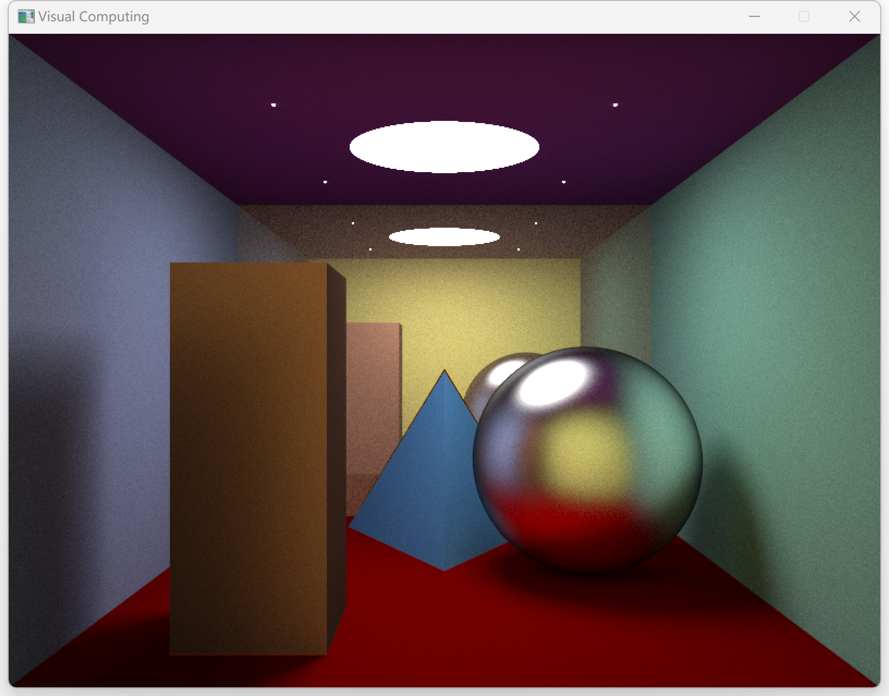

# Project3 - Render  

姓名: 张启哲  
学号: 1900011638  

本项目使用C++语言编程, 使用xmake编译后得到可执行文件, 直接运行该文件即可显示渲染效果, 同时支持命令行参数控制部分特性. 渲染过程实现了Ray Tracing和Path Tracing两种光线追踪方式, Ray Tracing渲染速度较快, Path Tracing计算量大但效果更加真实.

## Part 1 - 基本要求 (60%)  

待渲染的场景中共有3个物体和6面墙体, 其中物体的形状包括 `球体(Sphere)`, `长方体(Cuboid)` 和 `四面体(Tetrahedron)`, 材质包括单一颜色, 金属和镜面, 墙体的几何形状均为 `平面(Plane)`, 每个场景中均有1面四周的墙体材质为镜面. 场景中包括2种光源: 点光源和面光源, 每个场景中均同时存在2种光源. 场景每次创建时自动生成, 场景中的物体位置在一定范围内随机生成, 但每次均为球体, 长方体, 正四面体各1; 光源模式共有4种, 每种模式下光源的形状与位置均不同; 相机位姿在生成场景时也会发生变化, 为了保证较好的视觉效果, 自定义了4种模式, 每种模式下相机位于四周墙体的中心, 视角水平向前. 场景中的物体在随机生成时会出现不同程度的相互遮挡.

## Part 2 - 升级要求 (40%)  

除基本要求外, 本项目还实现了以下升级功能: `面光源`, `阴影`, `软阴影`, `镜面反射`(Mirror材质) 和 `间接光照`(最大反弹次数为10). 同时, 本项目还提供了Ray Tracing和Path Tracing两种光线追踪方式.

## Part 3 - 使用说明  

### Part 3.1 - 依赖  

* [xmake](https://xmake.io/#/): 项目构建工具, 参考[官方文档](https://xmake.io/#/guide/installation)安装
* [getopt.h](https://github.com/skandhurkat/Getopt-for-Visual-Studio/blob/master/getopt.h): C++命令行参数解析包, 本项目中已附带该包, 在 `src/common/getopt.h` 路径下, 若无法读取可前往官方代码库下载

### Part 3.2 - 编译  

编译命令:
```
xmake f -m release
xmake
```
* 重复编译出错时可以使用 `xmake clean` 清空缓存
* `xmake f -m debug` 可以切换到 debug 模式, 切换之后需要运行 `xmake -r` 重新编译
* xmake 会自动下载所需要的第三方库文件并链接到项目中, 如果下载过程中遇到网络问题, 有如下解决方式:
  - 可运行 `xmake g --proxy_pac=github_mirror.lua` 将 github.com 重定向到 hub.fastgit.xyz
  - 可运行 `xmake g --pkg_searchdirs=<download-dir>` 并根据报错提示手动下载
  - 打开本地代理, 使用命令行设置好环境变量 `HTTPS_PROXY="127.0.0.1:<port>"`, 之后在命令行中运行 `xmake`

### Part 3.3 - 运行  

自动运行命令:
```
xmake run
```
编译生成的二进制程序在 `bin` 目录下, 也可以使用命令行手动运行 `bin/SoftRender.exe` 可执行文件:
```
bin/SoftRender.exe [--fix --light <0, 1, 2, 3> --camera <0, 1, 2, 3> --tracing <ray, path>]
```
或:
```
bin/SoftRender.exe [-f -l <0, 1, 2, 3> -c <0, 1, 2, 3> -t <ray, path>]
```
其中 `--fix` / `-f` 参数可指定场景中物体固定在预先设计好的位置, 表现出最佳视觉效果; `--light` / `-l` 参数可指定场景中光源的模式(共4种); `--camera` / `-c` 参数可指定场景中相机的位姿(共4种); `--tracing` / `-t` 参数指定渲染模式(Ray Tracing或Path Tracing); `--help` / `-h` 参数查看参数列表详情.

## Part 4 - 效果展示  



